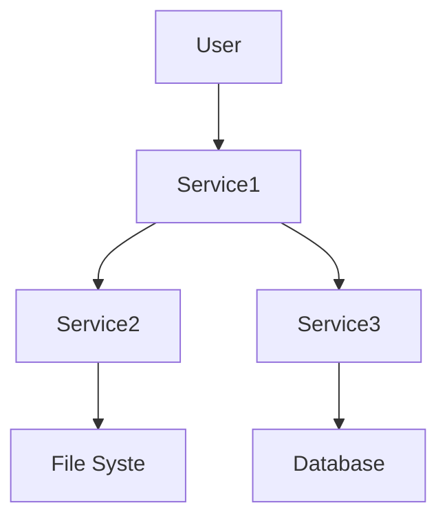

# Welcome to the Chatathon game!

Hello adventure seeker! We are glad you've joined us on this GitHub Copilot adventure! 

If you are seeking to attain stardom in the world of GitHub Copilot Chat, you are at the right place!

Sit tight, and scroll down!

## The levels to traverse

https://github.com/user-attachments/assets/82a16a20-d86d-443c-a40d-e3989b848f4b


# Getting Ready to play
<div style="display: flex;">
  <div style="flex: 50%;">     
    <!-- Content for the first column -->
    <p>https://github.com/user-attachments/assets/4adfeb14-c641-4017-b6cc-93dbca2d0206</p>
  </div>
  <div style="flex: 50%;">
    <!-- Content for the second column -->
    <p>On the right bottom corner of this window is your little helper, GitHub Copilot. He is waiting for you, his master, to propel you to Software glory! A gentle tap with your pointer will unleash this mythical creature, and set you on the journey!.</p>
  </div>
</div>


# On with the Challenges!
<details style="border: 1px solid #ccc; background-color: #f9f9f9; padding: 10px; border-radius: 4px;">
<summary>Challenge - 1</summary>
    
## Challenge - 1
### Overall Architecture of the Project and Identify Services


<div style="border: 1px solid #ccc; background-color: #f9f9f9; padding: 10px; border-radius: 4px;">
  <strong>Tip:</strong>
  At the right place and at the right time, Copilot's suggestions can make it fine! 
</div>

***Your job is to navigate to the correct folder of the repository, and ask Copilot to describe the architecture used in this repo, identify the various services and the languages they are implemented in!***

_hint: you'll want to navigate to one of the sub-folders_

The adventurer who gets the below right clears this level!
1. Overall repo architecture
2. The various services
3. The implementation languages 
</details>

## Challenge - 2
### Explain the Recommendation Service
Hey adventurer! Are you a visual person? Someone who loves to dismantle & re-assemble things. This level is for you!
With the help of the Copilot Extension for Mermaid Charts, create an architecture diagram of the `Recommendation Service`. 

#### Example Mermaid Diagram


_hint: You may need to ensure the Mermaid Chart Copilot extension is indeed available in your quiver, err browser_

<details style="border: 1px solid #ccc; background-color: #f9f9f9; padding: 10px; border-radius: 4px;">
<summary>Challenge - 1</summary>
  
## Challenge - 3
### Generate Test Cases for the Recommendation Service

### Scenario  
The **Recommendation Service** in the application currently has no test cases, leaving its functionality unverified and prone to potential bugs. Your task is to use **GitHub Copilot Chat** to create comprehensive test cases for this service and ensure its reliability.

### Challenge Instructions

#### 1. Understand the Recommendation Service  
Examine the codebase of the **Recommendation Service** to understand its core functionality, endpoints, and dependencies. Focus on identifying the inputs, outputs, and key business logic that should be tested.

#### 2. Use GitHub Copilot Chat to Generate Test Cases  
Leverage **Copilot Chat** to help you create robust and meaningful test cases. Use prompts to guide Copilot in generating tests. Ask copilot to generate test case code using `pytest` and `Mock` frameworks.


</details>

<details style="border: 1px solid #ccc; background-color: #f9f9f9; padding: 10px; border-radius: 4px;">
<summary>Challenge - 4</summary>
  
## Challenge - 4

### Investigate Slow Checkout Issue
- Users are reporting that the checkout process in the application is slow. Your task is to investigate the performance issues in the **checkout flow**.

### Challenge Instructions

#### 1. Understand the System Architecture  
The checkout flow involves multiple services working together to process an order. Dive into the relevant files to understand how the services interact. Start by identifying the key services involved in the checkout process, focusing on their roles and dependencies.

#### 2. Use GitHub Copilot to Identify Issues  
Leverage **GitHub Copilot** to analyze the code and spot potential bottlenecks. Use exploratory prompts to debug and understand the system, such as:
- "Identify inefficiencies in the checkout process."
- "Analyze the interaction between services in the checkout flow."
- "Suggest optimizations for service-to-service communication."

#### 3. Investigate Specific Components  
Start with the **frontend code** to ensure the checkout request is properly initiated and examine the flow into the **checkout service**. Then, investigate the backend services involved in the checkout flow for bottlenecks such as:
- Slow service-to-service communication.
- Inefficient database queries.
- Redundant API calls or synchronous operations that could be asynchronous.

### Success Criteria  
- You've identified at least one performance issue in the checkout process.

</details>

## Challenge - 5

### Product Catalog Service Bug
- The product catalog service has a bug where it is returning a single product's details for all calls. Find the affected code using Copilot.
```
